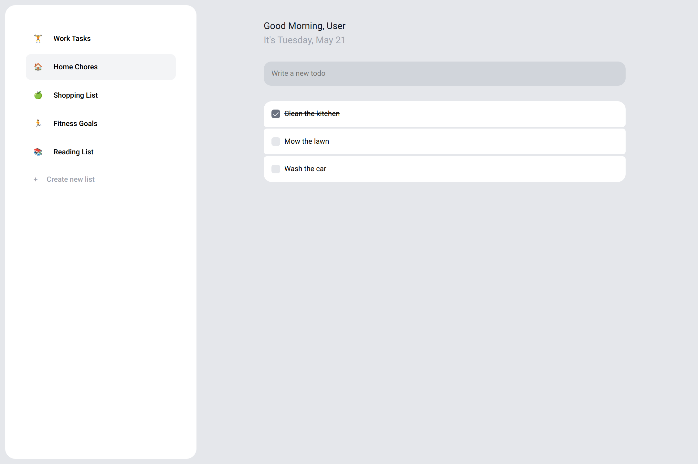

# dona.ai Clone 📝

Clone of [dona.ai](https://dona.ai) with React

## Demo

<p align="center">
  
</p>
<h2 align="center">
  <a href="https://dona-ai-clone.netlify.app">👉 Demo</a>
</h2>

## About

To do list app

## Features

- Add multiple todo lists
- Select an emoji for each list
- Responsive

## Tech Stack

- **UI Library:** React
- **Languages:** TypeScript, SCSS, HTML
- **Build Tool:** Next.js
- **Deployment:** Netlify
- **Dependencies:**
  - redux: State management
  - react-hook-form: User form
  - MUI: Drawer for mobile
  - uuid: Unique id's

## Run Locally

Clone the project

```bash
git clone https://github.com/amadeuio/dona.ai-clone
```

Go to the project directory

```bash
cd dona.ai-clone
```

Install dependencies

```bash
npm install
```

Start the server

```bash
npm run dev
```

## Acknowledgements

- [Google Icons](https://fonts.google.com/icons)
- [ChatGPT](https://chat.openai.com)

Shoutout to my code companions: Coffee & [Cozy Fireplace](https://www.youtube.com/watch?v=ze-TjhwceFE)

## License

[MIT](https://choosealicense.com/licenses/mit/)
