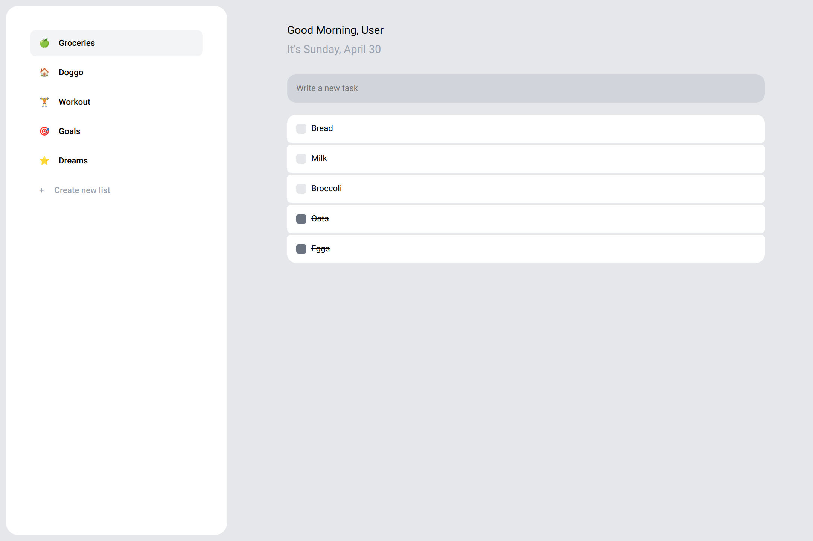

# dona.ai Clone 📝

  

<h2 align="center">
  <a href="https://amadeuio.github.io/dona.ai-clone">👉 Demo</a>
</h2>

### About 📖

[dona.ai](https://dona.ai) clone and fourth project of the JavaScript chapter in [The Odin Project](https://www.theodinproject.com). Desktop recommended

### Resources Used 📚

- [dona.ai](https://dona.ai) (UI Inspo)
- [Google Fonts](https://fonts.google.com) (Icons & Font)
- [EmojiTerra](https://emojiterra.com/) (Emojis)

### Built With 🛠️

- JS
- CSS
- HTML
